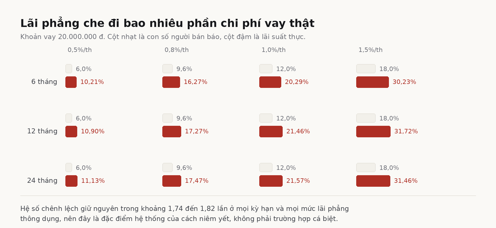
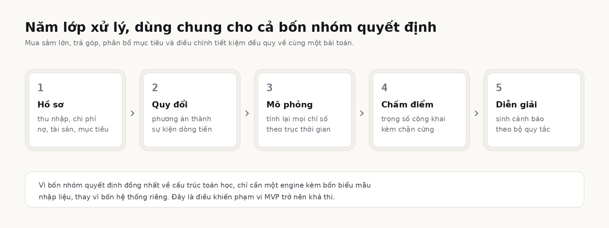
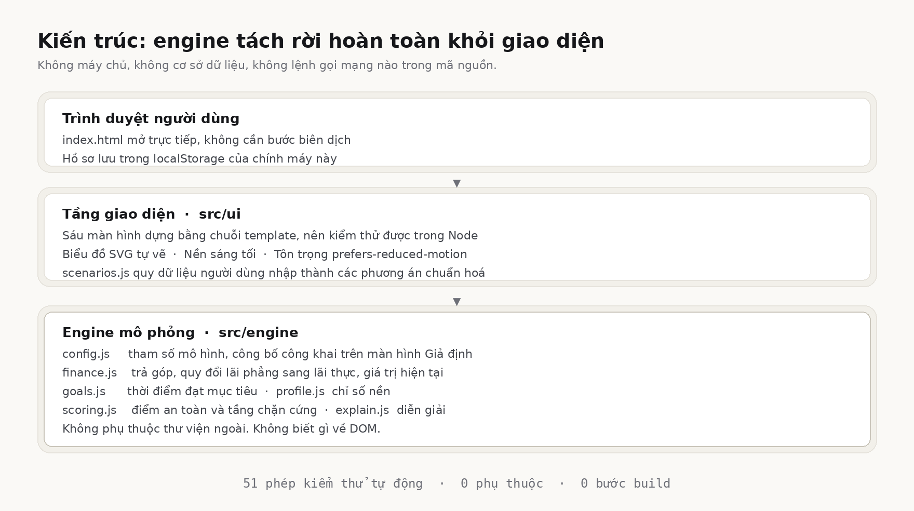

# DeciFin

**Nhìn thấy hệ quả trước khi tiêu tiền.**

Ứng dụng ghi chép chi tiêu cho bạn biết đã tiêu bao nhiêu. DeciFin cho bạn biết
nếu chọn phương án này thì quỹ dự phòng còn lại bao nhiêu, mục tiêu bị đẩy lùi
bao lâu, và gói trả góp kia thật ra đang tính lãi bao nhiêu.

[English](./README.en.md) · [Kiến trúc](./docs/ARCHITECTURE.md) · [Đặc tả thuật toán](./docs/ALGORITHM.md)

---

## Vấn đề

Người 18 đến 25 tuổi ở Việt Nam tiếp cận ngân hàng số rất sớm nhưng thiếu công cụ
lượng hoá hệ quả của một quyết định. Khi cân nhắc mua laptop, tham gia khoá học
hay chọn gói trả góp, họ chỉ nhìn thấy chi phí trước mắt.

Ví dụ cụ thể: một gói trả góp được chào là "lãi 1% mỗi tháng". Người mua nghe
thành 12% một năm.



Lãi suất thực là **21,46% một năm**. Chênh lệch giữ nguyên trong khoảng 1,74 đến
1,82 lần ở mọi kỳ hạn và mọi mức lãi phẳng thông dụng, nên đây là đặc điểm hệ
thống của cách niêm yết lãi suất phẳng chứ không phải trường hợp cá biệt.

## Cách hoạt động

Bạn khai báo thu nhập, chi phí, tài sản, nợ và mục tiêu. Bạn nhập một quyết định
đang cân nhắc cùng các phương án. DeciFin mô phỏng từng phương án và cho biết
tổng tiền phải chi, giá trị hiện tại của chi phí, quỹ dự phòng còn lại, nghĩa vụ
nợ, và thời điểm đạt từng mục tiêu bị dịch chuyển ra sao.



Bốn nhóm quyết định trong phạm vi hiện tại: mua sắm giá trị lớn, chọn gói trả
góp, phân bổ tiền giữa các mục tiêu, và điều chỉnh kế hoạch tiết kiệm. Cả bốn
đồng nhất về cấu trúc toán học nên dùng chung một engine.

### Kết quả mẫu

Người dùng thu nhập 12 triệu mỗi tháng, chi phí thiết yếu 6,5 triệu, tài sản
thanh khoản 25 triệu, cần mua thiết bị 25 triệu:

| Phương án | Tổng tiền chi | Giá trị hiện tại | Quỹ dự phòng còn | Điểm | Kết luận |
|---|---:|---:|---:|---:|---|
| Trì hoãn 4 tháng | 25.335.004 đ | 24.917.116 đ | 2,2 tháng | 72,9 | An toàn |
| Trả góp 12 tháng | 27.400.000 đ | 26.804.948 đ | 2,4 tháng | 64,5 | Cần thận trọng |
| Trả thẳng toàn bộ | 25.000.000 đ | 25.000.000 đ | 0,0 tháng | 35,0 | Không khuyến nghị |

Trả thẳng tốn ít tiền mặt nhất và không mất đồng lãi nào, nhưng bị xếp cuối vì
đưa quỹ dự phòng về 0. Chỉ cần một sự cố nhỏ là người dùng buộc phải vay với lãi
suất còn cao hơn. Đây là loại đánh đổi mà bảng ghi chép thu chi không chỉ ra được.

## Chạy thử

Không cần cài đặt gì. Không có bước biên dịch.

```bash
git clone https://github.com/<tài-khoản>/decifin.git
cd decifin
npm start          # mở http://localhost:5173
```

`npm start` chỉ gọi một máy chủ tĩnh 40 dòng viết bằng Node, không tải thư viện
nào về. Cần máy chủ vì trình duyệt chặn ES module khi mở tệp bằng giao thức
`file://`.

Chạy bộ kiểm thử:

```bash
npm test           # 51 phép kiểm thử, dùng node:test có sẵn
```

Yêu cầu duy nhất: Node phiên bản 20 trở lên.

## Kiến trúc



Ba lựa chọn đáng nói:

**Không phụ thuộc thư viện ngoài.** Toàn bộ dự án có 0 dependency. Với một công
cụ tài chính chạy trên máy người dùng, mỗi thư viện kéo theo là một bề mặt rủi ro
chuỗi cung ứng. Biểu đồ được vẽ tay bằng SVG trong 90 dòng.

**Không máy chủ, không cơ sở dữ liệu.** Dữ liệu thu nhập, nợ và tài sản là dữ
liệu cá nhân nhạy cảm. Ở giai đoạn kiểm chứng sản phẩm, cách an toàn nhất là
không thu thập gì. Hồ sơ chỉ nằm trong `localStorage` của chính trình duyệt đó.
Không có lệnh gọi mạng nào trong mã nguồn.

**Giao diện dựng bằng chuỗi template.** Mỗi hàm dựng màn hình là hàm thuần nhận
trạng thái trả về chuỗi HTML, nên kiểm thử được ngay trong Node mà không cần
trình duyệt giả lập. Đây là lý do bộ kiểm thử bao được cả tầng giao diện.

Chi tiết trong [docs/ARCHITECTURE.md](./docs/ARCHITECTURE.md).

## Thuật toán

Bốn phép tính cốt lõi, đầy đủ công thức trong [docs/ALGORITHM.md](./docs/ALGORITHM.md):

- **Quy đổi lãi phẳng sang lãi suất thực** bằng phương pháp chia đôi khoảng, giải
  phương trình `P = Σ M/(1+i)^t`. Chọn chia đôi thay vì Newton vì nó luôn hội tụ.
- **Giá trị hiện tại** của chuỗi chi tiêu, chiết khấu theo lãi suất cơ hội, để so
  sánh công bằng giữa trả ngay và trả dần.
- **Thời điểm đạt mục tiêu**, suy ra từ đẳng thức giá trị tương lai của dòng tiền
  đều có gốc ban đầu.
- **Điểm an toàn tài chính** 0 đến 100 theo năm thành phần có trọng số, kèm một
  tầng chặn cứng ghi đè kết quả khi phương án vi phạm ràng buộc tuyệt đối.

Tầng chặn cứng tồn tại vì điểm trọng số có thể bị các thành phần phụ kéo lên: một
phương án vét sạch quỹ dự phòng nhưng không phát sinh nợ vẫn đạt trên 60 điểm.

## Minh bạch giả định

Ứng dụng có một màn hình riêng liệt kê mọi tham số mô hình kèm nguồn gốc, và ghi
rõ tham số nào do nhóm tự đặt mà chưa xác minh. Giấu chúng đi sẽ khiến người dùng
tin vào kết quả nhiều hơn mức đáng tin.

DeciFin không phải tư vấn tài chính, tư vấn đầu tư hay khuyến nghị mua bán sản
phẩm tài chính. Quyền quyết định cuối cùng thuộc về người dùng.

## Cấu trúc thư mục

```
src/engine/     thuật toán tài chính, không biết gì về DOM
src/ui/         sáu màn hình, biểu đồ SVG, quản lý trạng thái
test/           51 phép kiểm thử chạy bằng node:test
tools/          máy chủ tĩnh, sinh hình minh hoạ, sinh trang preview
docs/           kiến trúc, đặc tả thuật toán, trang xem toàn bộ màn hình
```

`docs/preview.html` được sinh tự động từ chính mã giao diện nên không bao giờ
lệch với sản phẩm. Mở tệp đó để xem cả sáu màn hình trên một trang.

## Trạng thái dự án

Bản MVP, đang kiểm chứng với người dùng thực tế. Chưa có kết nối dữ liệu ngân
hàng và chưa có tài khoản người dùng, cả hai đều thuộc giai đoạn sau.

## Nhóm phát triển

Đội **5 đích 1 hướng**, dự thi Attacker 2026.

| Thành viên | Phụ trách |
|---|---|
| Quân | Engine mô phỏng, kiến trúc, triển khai |
| Đông | Giao diện và trải nghiệm người dùng |
| Thuỷ | Đối chiếu công thức tài chính, dự phóng kinh doanh |
| Thiên | Kiểm thử người dùng, rà soát tuân thủ |
| Đan | Nội dung sản phẩm, truyền thông |

## Giấy phép

[MIT](./LICENSE)
